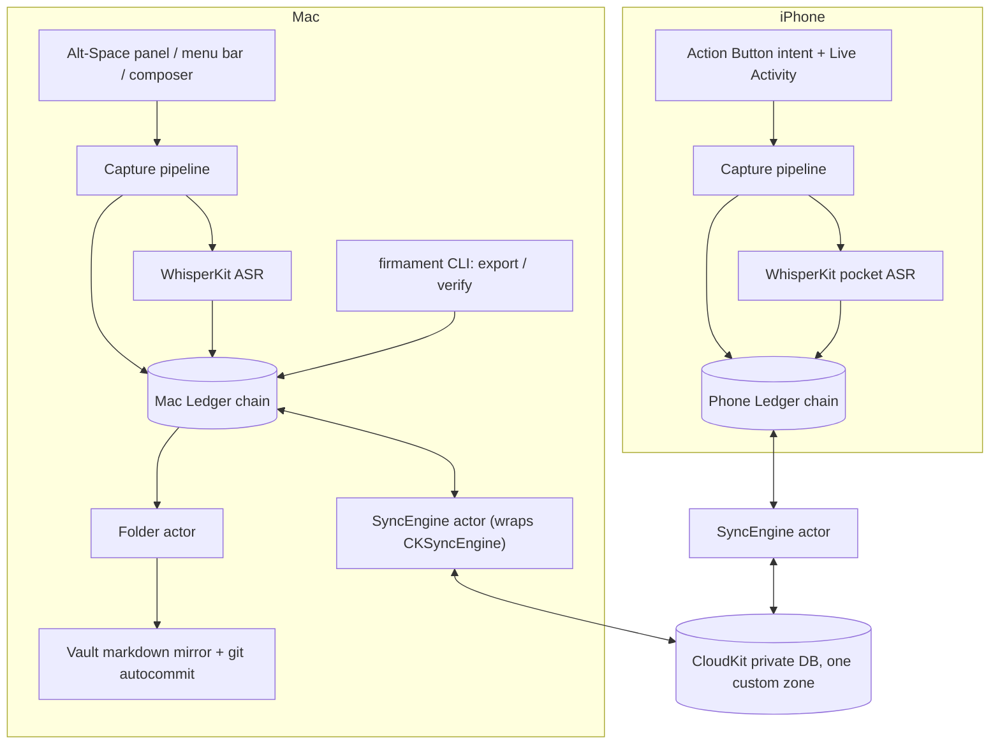

# Firmament v1.1 - Plan

## Goal Capsule

- **Objective:** Build **M0 — The Spine** of Firmament per [docs/SPEC.md](../SPEC.md) v1.1: the hash-chained append-only Ledger, Mac voice/text capture, WhisperKit transcription, the Vault markdown mirror, the `firmament` CLI, CloudKit sync, and the iPhone capture-only app.
- **Product authority:** [docs/SPEC.md](../SPEC.md) v1.1 (amended 2026-07-08, including the A7 storage erratum). Ambiguity resolves against its Ten Tenets (SPEC §2). This plan sequences M0 only; M1–M5 receive their own enrichment passes against this same artifact.
- **Execution profile:** greenfield Swift 6.2 build under `app/` (the location the README declares). Nothing outside `app/`, `docs/`, and CI config is touched; the landing page (`site/`) is untouched.
- **Stop conditions:** surface instead of guessing when (a) a decision would deviate from SPEC.md — spec amendments are a human ceremony, or (b) an operator-only step is needed (Apple Developer account, CloudKit container creation, test Apple ID, physical devices).
- **Tail ownership:** implementer runs the Verification Contract; the two-device sync check is operator-assisted (CloudKit push does not work in CI or simulators).
- **Open blockers:** none. Remaining open questions are deferred, not blocking (see Outstanding Questions).
- **Product Contract preservation:** unchanged except Outstanding Questions (planning resolutions, the WhisperKit lexicon licensing finding, and the Sanctum-encryption milestone question) and Scope Boundaries (share-sheet capture plane assignment; Sanctum capture gesture deferred until its app-level encryption ships — the doc-review round's P0 resolution).

---

## Product Contract

### Summary

Execute the Firmament build under spec v1.1, which ratifies six amendments over v1.0: the deterministic sky, Dawn (script-driven morning replay), Summon (one retrieval-rendering primitive), Weave (lasso-to-draft), three loop closures (echo, Converse, provocation), and Gate/Dream hardening. The first executable slice is M0, The Spine — this plan's Implementation Units cover exactly that slice.

### Key Decisions

- **The spec is the single canonical document.** Requirements live in [docs/SPEC.md](../SPEC.md); this plan holds the deltas, the slice contract, and sequencing. Duplicating the spec here would fork the constitution.
- **All six v1.1 amendments adopted, with their payments.** Nebula textures drop to a cluster density glow, the omnisearch list/constellation duality dissolves into Summon, watch capture moves to backlog, and M5 grows from two weeks to three.
- **Dawn is a renderer, not a rewrite.** COMPOSE emits the structured replay script from M2 onward; mornings render as text captions in the Ledger space until the Atlas ships the replay at M4.
- **Milestone order is unchanged (M0→M5).** The Atlas stays at M4, after the system is daily-useful in text, per the spec's Metal-scope-sink mitigation.

### Requirements

**Spec conformance**

- R1. [docs/SPEC.md](../SPEC.md) v1.1 governs every build decision; ambiguity resolves against its Ten Tenets (SPEC §2), and deviations require a dated changelog amendment.
- R2. Milestones execute in spec order M0→M5, with each milestone's spec acceptance criteria (SPEC §14) as its definition of done.

**v1.1 amendments (hold from first build)**

- R3. Every Lens, including Positions, rebuilds byte-for-byte from the Ledger: stochastic inputs seeded from the genesis hash, fixed-step integrator, deterministic iteration order, pinned UMAP seed+version (SPEC §6.6), verified by golden-Ledger replay (SPEC §16).
- R4. COMPOSE emits the Dawn script — structured scenes referencing star/edge/proposal IDs with captions — from M2; the Atlas plays it as a ~20-second replay from M4 (SPEC §8, §11.2).
- R5. All retrieval renders spatially through the single Summon path at M4: omnisearch, the voice orb, and agent trails share one Metal pipeline (SPEC §11.5).
- R6. Weave turns a lassoed constellation into a drafted work landing as an ordinary capture plus a `work` entity, with no new event kinds or predicates (SPEC §11.6).
- R7. Echo, Converse, and the provocation notification land in M5; Converse hosts both the phone walk mode and the Mac voice orb (SPEC §9.2, §12).
- R8. The Gate enforces per-grant rate limits (SPEC §10.1) and the Dream Cycle survives a closed lid via scheduled power-management wake (SPEC §8).

**M0 slice (this plan's Implementation Units)**

- R9. M0 scope per SPEC §14: Ledger with per-device hash chains, Mac audio/text capture, WhisperKit transcription, Vault folder, `firmament` CLI (export, verify), CKSync of events, iPhone capture-only build.
- R10. M0 acceptance per SPEC §14: an airplane-mode walk capture appears transcribed on the Mac after sync; `firmament verify` is green across both chains; the Vault is greppable; zero data loss across 50 scripted `kill -9`s mid-capture.

### Key Flows

Flows live in the spec and are not duplicated here: the signal path (SPEC §7.3), the Dream Cycle phases (SPEC §8), the escalation ceremony (SPEC §7.2), and the end-to-end capture example (SPEC §17.2). M0 implements the capture and transcription portions of §7.3 (steps 1 and 4, minus embedding) plus §9.2's capture UX.

### Scope Boundaries

**Deferred for later**

- Vault write-back, ambient capture, image intelligence beyond OCR (SPEC §14).
- Watch capture (moved to backlog by v1.1).
- Full nebula textures — cluster density glow ships instead.
- The Sanctum capture gesture (SPEC §9.2 long-press) — ships together with Sanctum app-level encryption (SPEC §13) so unprotected Sanctum data never exists; milestone assigned at M2 planning. The tier remains in the envelope/schema from U2; M0 captures default `.personal`.

**Deferred to Follow-Up Work (M1+ enrichment passes)**

- Retrieval (embed slot, fused search, omnisearch) — M1.
- Worker extraction, Graph Lens, Dream Cycle, Chamber, lexicon loop — M2.
- The Gate, grants, projections — M3. The Atlas — M4. Polish and ritual — M5.
- Share-sheet capture (iOS + Mac) and the iPhone text composer — not in SPEC §14's M0 line; scheduled with the M1 enrichment pass.
- SpeechAnalyzer fallback implementation (M0 ships the protocol seam and the WhisperKit implementation only).

**Outside this product's identity**

- Multi-operator anything, auth, multi-tenancy (Tenet 9).
- Cloud-resident memory or proxied inference (Tenet 3).
- Any agent read/write path other than the Gate (Tenet 6).

### Dependencies / Assumptions

- Platform floor: macOS 26 / iOS 26, Swift 6.2, strict concurrency; dependency list is closed per SPEC §17.1. M0 uses GRDB.swift and WhisperKit (`argmax-oss-swift`) plus Apple frameworks only.
- Operator provides: Apple Developer ID, a CloudKit container, a dedicated test Apple ID for sync testing, and physical Mac + iPhone hardware.
- Tailscale is an environmental assumption, not a linked dependency (not needed until M3).
- The repo currently contains only the landing page (`site/`) and the spec — the Swift build is greenfield (verified 2026-07-08).

### Outstanding Questions

**Deferred to M2 planning**

- Lexicon strategy: WhisperKit's custom-vocabulary boost is a paid Pro-SDK feature, not in the open-source package. Options when M2 lands: OSS prompt-token conditioning (API presence in v1.0 unverified), post-ASR fuzzy lexicon correction, or a Pro license. SPEC §9.3's lexicon loop is unaffected at M0.
- Dawn script payload schema (scene shape within the `distillation` payload).
- Model fills for embed/worker/dreamer/pocket slots (M0's only model is WhisperKit).
- Which milestone ships Sanctum app-level encryption (Keychain/Secure-Enclave key, SPEC §13) and with it the Sanctum capture gesture deferred out of M0.

**Deferred to implementation (non-blocking)**

- Empirically confirm ⌥Space is unclaimed on a clean macOS 26 install before hardcoding it (Option-only hotkeys regressed once, in macOS 15; fixed since).
- Action Button cold-start latency (no published numbers) — measured by the U1 spike in Phase A.
- Whether `PRAGMA fullfsync=ON` adds real durability on Apple's bundled SQLite (reports say it substitutes `F_BARRIERFSYNC`); the kill-9 acceptance gate does not depend on it.

---

## Planning Contract

### Key Technical Decisions

- KTD1. **The hash covers the canonical envelope, with the payload represented inside it by its SHA-256 digest (`payloadHash`); payload bytes are stored verbatim and verification re-hashes stored bytes — never a re-serialization.** No maintained Swift RFC 8785 implementation exists, and `JSONEncoder` determinism is not contractual across Foundation versions. FirmamentKit defines a restricted canonical value model (objects/arrays/strings/Int64/bool/null; ASCII keys; no floats or Date — timestamps are Int64 epoch-milliseconds; strings NFC-normalized; keys sorted by UTF-16 code unit) with a small hand-written serializer tested against the RFC 8785 vectors. The digest-in-envelope construction avoids concatenation framing ambiguity and keeps chains verifiable after a payload is crypto-shredded (SPEC §5.2, §13). Ratified as spec amendment A7.
- KTD2. **Durability discipline: WAL + `synchronous=NORMAL` (per SPEC §5.3), with `F_FULLFSYNC` on the audio file and its parent directory before the event row is inserted.** Kernel-cached WAL writes survive `kill -9` regardless of synchronous level, so the spec's crash-loss contract ("at most the current utterance's tail") holds at NORMAL. The recorder flushes CAF frames to a durable temp location periodically *during* capture, so a crash mid-recording preserves everything but the tail. Finalize ordering: flush temp file → `F_FULLFSYNC` file → rename to the content-addressed path → `F_FULLFSYNC` parent directory → append event. A crash at any point leaves at worst a recoverable partial recording or an orphan file — never an event row pointing at a missing local file. Launch reconciliation **adopts** partial recordings (validate/repair the CAF header → hash → rename → append `capture.audio` with interrupted-capture context) and garbage-collects only files that are provably empty or already adopted.
- KTD3. **Genesis hash is chain-specific:** each device chain's first `prevHash` is `SHA256(deviceID || "firmament-genesis-v1")`, not zeros, so a forged sub-chain from another device cannot be spliced in. This constant also seeds R3's deterministic folds later.
- KTD4. **UUIDv7 is hand-rolled (~40 lines, RFC 9562)** with a per-device monotonic guard within the same millisecond. Foundation has no v7 generation (proposal SF-0041 was still in review mid-2026); the API mirrors SF-0041's shape (`UUID.v7(at:)`) for painless migration.
- KTD5. **Project shape: one `.xcodeproj` with buildable folders plus FirmamentKit as a local SPM package.** No Tuist/XcodeGen — Xcode 16+ buildable folders removed the pbxproj-churn rationale, and a solo project doesn't need generation. The CLI is an `executableTarget` in the same package so `swift test`/`swift build` exercise Kit + CLI without Xcode. The iOS side needs a WidgetKit extension target (Live Activity + lock-screen widget). GRDB pinned `^7.0` (Swift 6-clean); `argmax-oss-swift` pinned to an exact release.
- KTD6. **Ledger concurrency: GRDB `DatabasePool` in the app (single serialized writer via the `Ledger` actor, snapshot readers for folds/UI), `DatabaseQueue` in the CLI.** Both connection types set `journal_mode=WAL` + `synchronous=NORMAL` explicitly in `prepareDatabase` — DatabaseQueue does not default to WAL — so every ledger shares one durability configuration. WAL supports the CLI reading the same file as a separate process. `ValueObservation` notifies the Folder; folds never run inside observation closures.
- KTD7. **CKSync design:** record name = event UUIDv7 (`event:` prefix reserves room for future types), one custom zone in the private database. The record carries the **complete envelope — including `payloadHash`, `prevHash`, and `hash`, stored verbatim on ingest** — plus the canonical payload bytes in `encryptedValues`, so a device can verify a foreign chain entirely from synced records (CKAssets are excluded from encryptedValues but are encrypted by default). A `capture.audio` record uploads only once its asset is staged — transcript/text records go first, preserving SPEC §5.5's asset-lag allowance without ever modifying a record. Oversized records (CKRecord caps ~1 MB) spill transport-side: the event's verbatim canonical payload bytes ship as a CKAsset instead of `encryptedValues`, and ingest re-hashes the asset bytes against the envelope's `payloadHash` — the payload itself is never restructured. `serverRecordChanged` is expected on redundant re-uploads of immutable records: adopt the server record's system fields, drop the pending save, and assert payload byte-equality as a tamper alarm. `CKSyncEngine.State.Serialization` persists on every `stateUpdate`. The local Ledger — not the engine's pending queue — is the durability boundary; `.purged`/`.encryptedDataReset` trigger full re-upload from the Ledger. Ingest is idempotent by event id.
- KTD8. **Folds are idempotent and rebuildable-from-genesis.** Each Lens carries `(viewVersion, highWaterEventID)` metadata; a version bump truncates and refolds. The Vault fold orders a day's events by `occurredAt` then event id — deterministic given the event set, so late-arriving synced events refold the affected day files rather than patching in place. This satisfies R3 for M0's only Lens.
- KTD9. **Transcription sits behind an `ASRProviding` protocol; M0 ships the WhisperKit implementation with exact per-device, date-versioned model pins** — `macASRModel` and `phoneASRModel`, which may share a value when hardware allows (models are pinned by name in the `argmaxinc/whisperkit-coreml` repo; the phone pin is validated in the U1 spike). The transcription queue is scoped to **local-device captures only** (`deviceID == self`) — foreign captures arrive with their own transcripts per KTD11, and a sync race must not produce duplicates. Transcription is recoverable-async: on launch, any local `capture.audio` without a child `transcript` re-queues. The verbatim text is the event payload; no polish pass until M2. SpeechAnalyzer conforms to the same protocol later.
- KTD10. **⌥Space via hand-rolled Carbon `RegisterEventHotKey` (~50 lines) and an `NSPanel` capture panel** (`.nonactivatingPanel`, `.canJoinAllSpaces`, floating level, SwiftUI content via `NSHostingView`). Zero TCC prompts, zero third-party UI dependencies, no CGEventTap fragility. This is the only sanctioned permission-free global-hotkey path on macOS.
- KTD11. **iPhone capture uses `AudioRecordingIntent` (iOS 18+), which requires starting a Live Activity while recording** — the Live Activity doubles as the stop/status surface and lives in a WidgetKit extension target. The phone transcribes on-device per Tenet 4 with its own pinned WhisperKit model (`phoneASRModel`, KTD9), so an airplane-mode capture syncs both `capture.audio` and its `transcript` when connectivity returns. Audio files live in the App Group container (SPEC §5.2) so the intent/extension and app share access. KTD11's final shape gates on the U1 latency spike.

### High-Level Technical Design

M0 dataflow — every arrow into the Ledger is an event append; everything right of it is derived or transported:



The crash-safe append path (KTD2), which U4 implements and U11 attacks:

```mermaid
sequenceDiagram
  participant R as Recorder
  participant C as Capture pipeline
  participant FS as APFS
  participant L as Ledger actor (GRDB writer)
  R->>FS: stream CAF frames to durable temp path (periodic flush during capture)
  R->>C: stop() finalizes
  C->>FS: F_FULLFSYNC(temp file fd)
  C->>FS: rename to audio/<sha256>.caf
  C->>FS: F_FULLFSYNC(parent directory fd)
  C->>L: append(capture.audio event)
  L->>L: canonicalize payload; payloadHash; hash = SHA256(canonical envelope)
  L->>FS: INSERT event row (WAL commit)
  Note over R,L: crash mid-recording = partial temp file, ADOPTED at next launch;<br/>crash mid-finalize = orphan file at worst, never a dangling row
```

### Output Structure

```
app/
  Firmament.xcodeproj          # buildable folders; references the local package
  Mac/                         # thin macOS app target (menu bar, panel, composer)
  iOS/                         # thin iOS app target (capture screen, intent)
  iOSWidgets/                  # WidgetKit extension: Live Activity + lock-screen widget
  FirmamentKit/
    Package.swift              # library FirmamentKit + executableTarget firmament
    Sources/
      FirmamentKit/            # Event, canonical JSON, chains, Ledger, capture, folds, Vault, sync, ASR
      firmament/               # CLI entry point (export, verify, stress-capture)
    Tests/
      FirmamentKitTests/       # 90% of tests live here (SPEC §11.7)
  scripts/
    crash-harness.sh           # scripted kill -9 loop (R10)
.github/workflows/ci.yml       # fast tier: swift test; slow tier: xcodebuild
```

The tree is a scope declaration; per-unit `Files` stay authoritative.

### Sequencing

Phased by dependency; units within a phase can proceed in parallel where dependencies allow.

- **Phase A — Foundation:** U1, U2, U3
- **Phase B — Capture and transcription:** U4, U5, U6
- **Phase C — Lens and CLI:** U7, U8
- **Phase D — Sync and satellite:** U9, U12, U10
- **Phase E — Acceptance:** U11

### Risks & Dependencies

- **CloudKit sync is untestable in CI** (push requires real devices; simulators can't register). Mitigation: KTD7 keeps mapping/ingest/conflict logic pure and unit-tested with synthetic records (U9); only the thin engine wiring (U12) needs the operator-assisted two-device check.
- **Action Button cold-start latency is unpublished** and the spec calls missing the first two seconds "product-killing" (SPEC §9.2). Mitigation: the latency spike runs in U1 (Phase A), before anything depends on KTD11's shape; if the intent path is too slow, fall back to warm-up in a persistent audio session and record the finding for a spec conversation.
- **CKRecord size limits vs unbounded text payloads:** clipboard/file-drop captures can exceed the ~1 MB record cap. Mitigation: the KTD7 spill-to-asset policy, tested in U9.
- **Apple's bundled SQLite reportedly substitutes `F_BARRIERFSYNC` for `F_FULLFSYNC`** (community-corroborated, unverified). The kill-9 gate doesn't depend on it; true power-loss hardening would require vendoring SQLite — explicitly out of M0 scope.
- **WhisperKit v1.0 API drift:** the package was renamed (`argmax-oss-swift`) with deprecated APIs removed in May 2026; pin exactly and verify `DecodingOptions` shape at first build.
- **Xcode/macOS 26 UI landmines:** the Option-only hotkey regression (macOS 15, since fixed) and early-Tahoe `NSPanel` `canBecomeKey` crash reports — both get explicit smoke tests in U5.

### Sources & Research

- [docs/SPEC.md](../SPEC.md) — canonical spec, v1.1 + A7; SPEC §17.3 for prior-art sources.
- GRDB 7 concurrency and WAL defaults: github.com/groue/GRDB.swift (CHANGELOG, Concurrency guide).
- CKSyncEngine field experience: christianselig.com/2026/01/cksyncengine; apple/sample-cloudkit-sync-engine (issues #5, #6); WWDC23-10188; pointfreeco/sqlite-data discussions #272/#334 (conflict, 400-item batching).
- Canonicalization: RFC 8785 (JCS) + its test vectors; swift-corelibs-foundation issues #4702/#3972 (sortedKeys divergence); eclecticlight.co on APFS Unicode normalization.
- Crash safety: sqlite.org/wal.html, pragma_synchronous, howtocorrupt.html; Apple fsync(2) man page (F_FULLFSYNC); arxiv 2511.18323 (APFS crash-injection study; atomic-dirsync pattern).
- UUIDv7: RFC 9562; swift-foundation proposal SF-0041 (in review as of 2026-05).
- WhisperKit/Argmax: github.com/argmaxinc/argmax-oss-swift (v1.0.0); app.argmaxinc.com/docs custom-vocabulary (Pro-only); huggingface.co/argmaxinc/whisperkit-coreml (date-versioned model pins).
- Action Button recording: developer.apple.com/documentation/appintents/audiorecordingintent (Live Activity requirement).
- Hotkey/panel: Apple DTS forum thread 735223 (RegisterEventHotKey has no modern replacement, no TCC); NSPanel `.nonactivatingPanel` recipes (ardentswift.com, cindori.com).
- Exit tests: swift-evolution ST-0008 (implemented, Swift 6.2; macOS only — not iOS).

---

## Implementation Units

Unit Index:

| U-ID | Title | Key files | Depends on |
|---|---|---|---|
| U1 | Workspace scaffold + CI | `app/Firmament.xcodeproj`, `app/FirmamentKit/Package.swift`, `.github/workflows/ci.yml` | — |
| U2 | Event model, canonical JSON, hash chains, golden fixture | `app/FirmamentKit/Sources/FirmamentKit/Event/` | U1 |
| U3 | Ledger store (GRDB) | `app/FirmamentKit/Sources/FirmamentKit/Ledger/` | U2 |
| U4 | Crash-safe capture pipeline + recorder core | `app/FirmamentKit/Sources/FirmamentKit/Capture/` | U3 |
| U5 | Mac app shell (hotkey, panel, composer) | `app/Mac/` | U4 |
| U6 | Transcription (WhisperKit behind ASRProviding) | `app/FirmamentKit/Sources/FirmamentKit/ASR/` | U4 |
| U7 | Fold engine + Vault Lens | `app/FirmamentKit/Sources/FirmamentKit/Lenses/` | U3, U6 |
| U8 | firmament CLI (export, verify) | `app/FirmamentKit/Sources/firmament/` | U3 |
| U9 | Sync mapping, ingest, and conflict logic (pure) | `app/FirmamentKit/Sources/FirmamentKit/Sync/` | U3 |
| U12 | CKSyncEngine wiring, state, accounts | `app/FirmamentKit/Sources/FirmamentKit/Sync/` | U9 |
| U10 | iPhone capture app + widget extension | `app/iOS/`, `app/iOSWidgets/` | U4, U6, U12 |
| U11 | Acceptance harness (kill-9 suite, R10 checklist) | `app/scripts/crash-harness.sh` | U4, U7, U8 (R10 sync leg: U12, U10) |

### U1. Workspace scaffold + CI

- **Goal:** A building skeleton: Xcode project (buildable folders) with thin macOS and iOS app targets plus the iOS WidgetKit extension target, the FirmamentKit local package with library + `firmament` executable targets, two-tier CI, and the Action Button latency spike that gates KTD11.
- **Requirements:** R9 (foundation for all M0 work).
- **Dependencies:** none.
- **Files:** `app/Firmament.xcodeproj`, `app/Mac/FirmamentApp.swift`, `app/iOS/FirmamentApp.swift`, `app/iOSWidgets/` (extension stub with `NSSupportsLiveActivities`), `app/FirmamentKit/Package.swift`, `app/FirmamentKit/Sources/FirmamentKit/FirmamentKit.swift`, `app/FirmamentKit/Sources/firmament/main.swift`, `app/FirmamentKit/Tests/FirmamentKitTests/SmokeTests.swift`, `.github/workflows/ci.yml`.
- **Approach:** Package declares `platforms: [.macOS(.v26), .iOS(.v26)]`, `swiftLanguageMode(.v6)`; app targets set Swift 6 mode explicitly in build settings (independent of the package setting). App Group configured for the iOS app + extension (audio container per SPEC §5.2/KTD11). Dependencies: GRDB `^7.0` now; `argmax-oss-swift` added in U6. CI fast tier runs `swift test` in `app/FirmamentKit` on `macos-26` runners with a pinned Xcode; slow tier (PR-to-main) runs `xcodebuild` for the app targets. Hardened runtime on; entitlements per SPEC §11.7 (CloudKit, network-server, microphone); not sandboxed on macOS. Closes with the KTD11 spike: a throwaway `AudioRecordingIntent` + Live Activity stub on the scaffolded iOS/widget targets, measuring press-to-first-sample from a locked phone on hardware; KTD11's final shape and `phoneASRModel` (KTD9) gate on the result before Phase B begins.
- **Patterns to follow:** SPEC §11.7 target/actor architecture; README's `app/` layout declaration.
- **Test scenarios:** Test expectation: none — scaffolding; the smoke test (package imports, one trivial `#expect`) exists to prove the CI loop.
- **Verification:** `swift test` passes locally and in CI; all Xcode targets build via `xcodebuild`; spike latency measured on hardware and logged.

### U2. Event model, canonical JSON, hash chains, golden fixture

- **Goal:** The Ledger's value layer: `Event` envelope (including `payloadHash` per A7), closed `EventKind` dozen, `Tier`/`Author`/`DeviceID`, UUIDv7 generation, canonical serialization, per-device SHA-256 chain computation, and the golden-Ledger fixture that anchors determinism testing for every later unit.
- **Requirements:** R3 (canonical bytes, deterministic), R9; SPEC §5.1–5.2, A7.
- **Dependencies:** U1.
- **Files:** `app/FirmamentKit/Sources/FirmamentKit/Event/Event.swift`, `EventKind.swift`, `UUIDv7.swift`, `CanonicalJSON.swift`, `HashChain.swift`; tests in `app/FirmamentKit/Tests/FirmamentKitTests/` (`CanonicalJSONTests.swift`, `HashChainTests.swift`, `UUIDv7Tests.swift`) plus `Tests/FirmamentKitTests/Fixtures/golden-ledger.ndjson`.
- **Approach:** KTD1 (digest-in-envelope preimage: `hash = SHA256(canonical(envelope))` where the envelope includes `payloadHash`; payload bytes stored verbatim), KTD3 (chain-specific genesis), KTD4 (UUIDv7 with monotonic guard). Timestamps are Int64 epoch-ms everywhere. The `EventKind` enum closes at twelve, but typed payload structs exist only for the kinds M0 produces (`capture.audio`, `capture.text`, `transcript`, `tombstone`, `sync.checkpoint`); the remaining kinds carry opaque canonical-value payloads until their milestone's planning pass freezes their schemas. M0 payload structs serialize *through* the canonical value model, never directly through `JSONEncoder`. The golden fixture (~200 events: two device chains, out-of-order arrival, tombstones, all three tiers) is generated deterministically and checked in here.
- **Test scenarios:**
  - Happy path: each M0-produced kind round-trips struct → canonical bytes → struct; hashes stable across process runs; opaque-payload kinds round-trip as raw canonical values.
  - Canonicalization edges: NFC vs NFD input strings produce identical bytes; non-ASCII values escape per RFC 8785; keys sort by UTF-16 code unit not locale; RFC 8785 test vectors (minus float cases, which the model forbids at the type level) pass.
  - UUIDv7: 10k IDs in one millisecond stay monotonic; version/variant bits correct; timestamps recoverable.
  - Chain: genesis prevHash differs per device; altering any stored payload byte breaks `payloadHash` at exactly that event; altering an envelope field breaks `hash`; two-device interleave verifies independently per chain.
  - Golden fixture: chain verification over `golden-ledger.ndjson` is green and byte-stable (encoder-drift tripwire).
  - Error paths: payload containing a lone surrogate throws; non-ASCII key throws at construction.
- **Verification:** all tests green; the fixture file byte-compares on every CI run.

### U3. Ledger store (GRDB)

- **Goal:** The persistent Ledger: STRICT schema per SPEC §5.3 (A7 types), single-writer `Ledger` actor with the sacred append path, snapshot reads, FTS5 external-content table, and chain verification queries.
- **Requirements:** R9; SPEC §5.3; Tenet 1.
- **Dependencies:** U2.
- **Files:** `app/FirmamentKit/Sources/FirmamentKit/Ledger/LedgerStore.swift`, `Ledger.swift` (actor), `Schema.swift`; `Tests/FirmamentKitTests/LedgerTests.swift`.
- **Approach:** KTD6 (DatabasePool in-app, DatabaseQueue in CLI). Schema per SPEC §5.3: `payload` BLOB holds canonical bytes verbatim, `payload_hash` BLOB, INTEGER epoch-ms timestamps. Append is `INSERT`-only; no UPDATE/DELETE statements exist in the codebase (tombstones are new events, honored by Lenses). LedgerStore sets `journal_mode=WAL` and `synchronous=NORMAL` explicitly in GRDB's `prepareDatabase` hook for every writable connection — DatabasePool and DatabaseQueue alike — so CLI-created ledgers share the app's durability semantics. The FTS leg is a contentless FTS5 table (`content=''`) keyed by event rowid, populated by the `Ledger` actor inside the same append transaction, indexing extracted human text only at M0 (`capture.text` bodies, `transcript` text; other kinds skipped). `ValueObservation` publishes new-event notifications for the Folder.
- **Test scenarios:**
  - Happy path: append N events, read back in id order, chain verifies.
  - Idempotent ingest: inserting an event with an existing id is a no-op (sync path contract).
  - Tombstone: appending a tombstone leaves the target row intact (Lens-level honoring is U7's test).
  - FTS: payload text of a `capture.text` is findable via BM25 query; a `transcript`'s text is findable; a `sync.checkpoint` is not indexed.
  - Durability config: a ledger created via the CLI's DatabaseQueue is in WAL mode with synchronous=NORMAL.
  - Concurrency: parallel readers during sustained appends see consistent snapshots (no torn reads).
- **Verification:** tests green; `sqlite3` CLI inspection shows STRICT tables and WAL mode.

### U4. Crash-safe capture pipeline + recorder core

- **Goal:** The platform-free capture core: the recorder state machine, content-addressed audio file writing with the KTD2 fsync ordering and periodic in-capture flush, `capture.audio`/`capture.text` append APIs with tier stamping, and launch-time reconciliation that adopts interrupted recordings.
- **Requirements:** R9, R10 (zero data loss); SPEC §9.2 ("file first, envelope second, both fsynced"), §11.7 ("loses at most the current utterance's tail").
- **Dependencies:** U3.
- **Files:** `app/FirmamentKit/Sources/FirmamentKit/Capture/CapturePipeline.swift`, `RecorderStateMachine.swift`, `AudioFileStore.swift`, `Reconciler.swift`; `Tests/FirmamentKitTests/CapturePipelineTests.swift`, `Tests/FirmamentKitTests/RecorderStateMachineTests.swift`.
- **Approach:** KTD2 in full: frames stream to a durable temp path with periodic flush during capture; finalize runs temp-fsync → rename to `audio/<sha256>.caf` → dir-fsync → append. Storage root is the app container on macOS and the App Group container on iOS (SPEC §5.2). The recorder state machine (start/stop/interruption/double-stop) is platform-free here; U5/U10 supply thin AVAudioEngine/session adapters. The Reconciler distinguishes three states: orphan *complete* file (no event → adopt or GC), orphan *partial* temp file (interrupted capture → validate/repair CAF header, hash, rename, append `capture.audio` with interrupted-capture context — never silently delete), and local event without its file (fatal invariant breach, loud). Foreign events whose CKAsset hasn't downloaded yet are *expected* pending state, tracked for retry — not a breach (KTD7).
- **Execution note:** implement the ordering and reconciliation test-first — the invariants ("no local event row without its file"; "an interrupted recording survives as an event") are the unit's whole point.
- **Test scenarios:**
  - Happy path: capture writes file + event; hash in payload matches file content hash.
  - Covers the R10 contract at unit level: process killed between each pair of finalize steps (exit tests, ST-0008, macOS test target) leaves either an adoptable partial or an orphan file — never a dangling local event row; reconciliation then converges.
  - Interrupted capture: kill during active recording → relaunch → reconciler adopts the partial as a `capture.audio` event whose audio plays up to the flush point.
  - Recorder state machine: start→stop emits exactly one capture; rapid double-stop is safe; interruption (simulated phone call) finalizes a partial through the same path.
  - Text capture: `capture.text` append with each source plane; all three tiers store identically at the schema level (tier is data, not a branch) — M0 capture surfaces stamp `.personal` by default, the Sanctum gesture being deferred (see Scope Boundaries).
  - Edge: duplicate content (same audio hash twice) produces two events referencing one file; reconciler doesn't collect it while referenced. Foreign event pending asset download is not flagged as a breach.
- **Verification:** unit tests green including exit tests; the full 50-kill scripted suite is U11.

### U5. Mac app shell

- **Goal:** The Mac capture surface: menu-bar app, ⌥Space floating glass panel (waveform, elapsed, stop), markdown composer window, drag/clipboard capture via hotkey.
- **Requirements:** R9; SPEC §9.2 (Mac), §5.4 (tier default).
- **Dependencies:** U4.
- **Files:** `app/Mac/MenuBar.swift`, `HotKey.swift`, `CapturePanel.swift`, `CapturePanelView.swift`, `ComposerView.swift`, `MacAudioAdapter.swift`.
- **Approach:** KTD10 (Carbon hotkey, `NSPanel` recipe). `AVAudioEngine` feeds U4's recorder core; the adapter stays thin — state logic and tests live in FirmamentKit (U4). `LSUIElement` app — no Dock icon. Captures stamp `.personal` by default; the tier toggle (SPEC §9.2's long-press Sanctum gesture) is deferred until Sanctum app-level encryption ships, so unprotected Sanctum data can never exist (see Scope Boundaries).
- **Test scenarios:** state-machine coverage lives in U4 (`RecorderStateMachineTests.swift`); this unit's automated surface is the adapter seam (mic-permission-denied surfaces an error state and appends nothing). Manual smoke checklist: ⌥Space opens over a fullscreen app on another Space; panel doesn't steal frontmost-app focus; panel accepts keyboard input (the `canBecomeKey` override) without crashing on macOS 26; hotkey fires after app restart; Option-only modifier works on macOS 26.
- **Verification:** manual checklist green on macOS 26 hardware; capture lands in the Ledger and (after U7) in the Vault.

### U6. Transcription

- **Goal:** `ASRProviding` protocol + WhisperKit implementation with an exact pinned model; recoverable-async transcription of local-device captures emitting `transcript` events with segments and model/version stamps.
- **Requirements:** R9; SPEC §9.3 (pinned version, verbatim text), §7.3 step 1.
- **Dependencies:** U4.
- **Files:** `app/FirmamentKit/Sources/FirmamentKit/ASR/ASRProviding.swift`, `WhisperKitASR.swift`, `TranscriptionQueue.swift`; `Tests/FirmamentKitTests/TranscriptionQueueTests.swift`.
- **Approach:** KTD9. Batch file transcription — no streaming in M0. The queue watches for **local-device** `capture.audio` events lacking a child `transcript` (launch scan + `ValueObservation`), transcribes serially, appends `transcript` with `parentID`, `asrModel@version`, segments with timestamps. Foreign captures are excluded — their transcripts arrive by sync (KTD11). Model download is lazy with UI affordance; the exact date-versioned model name lives in one constant.
- **Test scenarios:**
  - Queue logic (mock ASRProviding): untranscribed local capture picked up on launch; already-transcribed skipped; failure retries with backoff and never blocks new captures; transcript's parentID and model stamp correct.
  - Sync race: a foreign `capture.audio` arriving before its `transcript` is *not* queued (deviceID scope); when the foreign transcript lands, no duplicate exists.
  - Integration (real WhisperKit, macOS test target, tagged slow): a checked-in 5-second CAF transcribes to non-empty text containing an expected word.
  - Edge: zero-length/corrupt audio file yields a failed-transcription state, not a crash, and no transcript event.
- **Verification:** instrumented latency — stop → `transcript` event appended — logged and < 1.5 s for a 1-minute note on target hardware (SPEC §7.3 budget); the Vault file (U7) is the manual observation surface.

### U7. Fold engine + Vault Lens

- **Goal:** The generic Lens fold loop (Folder actor, `(viewVersion, highWater)` metadata, truncate-and-rebuild on version bump) and the first Lens: the read-only Vault markdown mirror with git auto-commit.
- **Requirements:** R3 (deterministic rebuild), R9; SPEC §6, §6.1; Tenet 2.
- **Dependencies:** U3, U6 (transcripts are the Vault's main content).
- **Files:** `app/FirmamentKit/Sources/FirmamentKit/Lenses/Folder.swift`, `LensMetadata.swift`, `VaultLens.swift`, `VaultRenderer.swift`; `Tests/FirmamentKitTests/VaultLensTests.swift`, `Tests/FirmamentKitTests/Fixtures/golden-vault/`.
- **Approach:** KTD8. At M0 the Vault renders `journal/YYYY-MM-DD.md` (captures + transcripts, day-ordered by `occurredAt` then id, YAML frontmatter carrying event IDs) — entity files arrive with the Graph in M2. Day bucketing uses a pinned timezone constant (`America/New_York`) baked into the Vault Lens `viewVersion` — never the host timezone; changing it is a version bump + refold, and golden tests assert under the constant. If a capture ever has multiple transcripts, the Vault renders the one whose `deviceID` matches the capture's device (else the earliest by id) — a deterministic dedup rule. Tombstoned events render as absent; a tombstone arrival refolds affected days. Sanctum events render under the hidden `Vault/.sanctum/` dot-directory — which Spotlight does not index — as the §6.1-conformant mechanism (empty until the Sanctum gesture unlocks); verification includes an `mdfind` negative check. Auto-commit to a local git repo in the Vault directory after each fold pass, with `.sanctum/` excluded from the repo (gitignored) so Sanctum plaintext never enters git history and erasure stays file-delete + refold.
- **Test scenarios:**
  - Golden-Vault determinism (seeds SPEC §16's suite): U2's `golden-ledger.ndjson` folds to byte-identical files under `golden-vault/`; any change is a reviewed diff.
  - Covers R3 at M0 scope: fold, drop Lens, refold from genesis → byte-identical output.
  - Idempotency: folding the same event twice = folding once.
  - Late arrival: a synced event with yesterday's `occurredAt` refolds yesterday's file only.
  - Multi-transcript dedup: two transcripts for one capture render deterministically per the rule.
  - Tombstone honoring: tombstoned capture disappears from the rendered day; frontmatter of unaffected events unchanged.
- **Verification:** golden tests green (asserting under the pinned timezone); Vault greppable (R10); `git log` in the Vault shows one commit per fold pass with `.sanctum/` untracked; `mdfind` finds no `.sanctum/` content.

### U8. firmament CLI

- **Goal:** `firmament export` (newline-delimited JSON, the M0 hostage-proofing escape hatch) and `firmament verify` (chain verification against stored bytes, with gap-aware semantics for foreign chains), sharing FirmamentKit.
- **Requirements:** R9, R10 (`verify` green); SPEC §5.5 (export ships in M0), §11.7.
- **Dependencies:** U3.
- **Files:** `app/FirmamentKit/Sources/firmament/main.swift`, `ExportCommand.swift`, `VerifyCommand.swift`; `Tests/FirmamentKitTests/CLITests.swift`.
- **Approach:** Hand-rolled argument handling (the closed dependency list has no ArgumentParser). Export emits one canonical-JSON event per line, envelope fields plus payload verbatim from stored bytes. Verify walks each device chain re-hashing stored bytes (KTD1). Foreign-chain semantics: verify the contiguous prefix; a missing link is reported as **incomplete** (sync lag), distinct from **corrupt** (hash mismatch, exit 1); the latest `sync.checkpoint` head distinguishes lag from loss. Reports the first divergent event id.
- **Test scenarios:**
  - Export → re-import round-trip preserves every byte (export of an imported export is identical).
  - Verify: green on U2's golden fixture; flipping one payload byte reports that event id and exits 1; empty ledger verifies green.
  - Gapped foreign chain: a chain with a missing middle event reports incomplete (not corrupt); with a checkpoint head beyond the gap, reports the gap span.
  - Locked-DB behavior: CLI reads while the app holds the writer (WAL) without error.
- **Verification:** `swift run firmament verify` green against a real capture session's ledger.

### U9. Sync mapping, ingest, and conflict logic (pure)

- **Goal:** The CloudKit-independent half of sync: event ↔ CKRecord mapping (full envelope + chain fields + payload bytes), idempotent ingest into the Ledger, conflict policy, and the oversize-text spill policy — all unit-testable with synthetic records.
- **Requirements:** R9; SPEC §5.5.
- **Dependencies:** U3.
- **Files:** `app/FirmamentKit/Sources/FirmamentKit/Sync/RecordMapping.swift`, `Ingest.swift`, `ConflictPolicy.swift`; `Tests/FirmamentKitTests/RecordMappingTests.swift`, `Tests/FirmamentKitTests/IngestTests.swift`.
- **Approach:** KTD7's mapping: the record carries every envelope field including `payloadHash`, `prevHash`, and `hash` (stored verbatim on ingest — recomputing would mask tampering and cannot bridge gaps), payload bytes in `encryptedValues`, audio as CKAsset. `capture.audio` records are held until their asset is staged; transcript/text records ship first. Oversized records spill transport-side: the verbatim canonical payload bytes ride a CKAsset, verified against the envelope's `payloadHash` on ingest. Ingest is idempotent by id and triggers U7 refolds. Conflict policy: `serverRecordChanged` with byte-identical payload → adopt server system fields, drop pending save; with differing payload → loud integrity alarm, no overwrite.
- **Test scenarios:**
  - Mapping: event → record → event is identity across every envelope field, chain fields, and payload bytes; record name embeds the UUID.
  - Foreign-chain verification: ingesting a synthetic phone chain end-to-end lets `verify` pass on the Mac copy.
  - Conflict: identical-payload `serverRecordChanged` resolves silently; different-payload raises the alarm.
  - Ingest: duplicate delivery is a no-op; out-of-order delivery still verifies per-chain once complete; gap states report incomplete (U8 semantics).
  - Oversize text: a body above the cap round-trips via the transport spill path; ingest verifies the asset bytes against `payloadHash` and the chain stays intact.
  - Asset gating: a `capture.audio` without a staged asset is not offered for upload; its transcript is.
- **Verification:** tests green in CI — this unit never touches real CloudKit.

### U12. CKSyncEngine wiring, state, accounts

- **Goal:** The thin CloudKit-facing half: `SyncEngine` actor wrapping CKSyncEngine, zone creation, state-serialization persistence, account-state handling, asset copy-out in the delegate, and the daily `sync.checkpoint` event.
- **Requirements:** R9, R10 (airplane-mode round-trip); SPEC §5.5.
- **Dependencies:** U9.
- **Files:** `app/FirmamentKit/Sources/FirmamentKit/Sync/SyncEngine.swift`, `SyncState.swift`; `Tests/FirmamentKitTests/SyncStateTests.swift`.
- **Approach:** KTD7's operational half: one custom zone created via pending database changes; `CKSyncEngine.State.Serialization` persisted on every `stateUpdate` and passed back at init; CKAsset files copied into the audio store inside `handleEvent` (the temp file dies after it returns); signed-out captures queue locally with zero feature loss; `.purged`/`.encryptedDataReset` re-enqueue the full local Ledger. Emits `sync.checkpoint` per device per day carrying the chain head; the day boundary uses the same pinned timezone constant as the Vault fold (U7).
- **Test scenarios:**
  - State serialization round-trips across a simulated relaunch (persisted blob → new engine config).
  - Signed-out: appends queue locally; nothing is lost or errored.
  - Checkpoint: exactly one per device per day; carries the current chain head.
  - Engine wiring itself is device-verified (below), not CI-mocked — CKSyncEngine is a concrete class with no seam worth faking.
- **Verification:** two-device round-trip with a dedicated test Apple ID: capture on phone → audio + transcript + checkpoint appear on Mac; `firmament verify` green across both chains (R10's sync leg).

### U10. iPhone capture app + widget extension

- **Goal:** The capture-only satellite: Action Button intent → recording with Live Activity, one glance-able capture screen (waveform, elapsed, stop), lock-screen widget, on-device transcription, sync. Tier defaults `.personal`; the Sanctum gesture is deferred with U5's (see Scope Boundaries).
- **Requirements:** R9, R10; SPEC §9.2 (iPhone), §12 (capture capability only).
- **Dependencies:** U4, U6, U12.
- **Files:** `app/iOS/CaptureIntent.swift`, `CaptureView.swift`, `PhoneAudioAdapter.swift`, `app/iOSWidgets/RecordingLiveActivity.swift`, `app/iOSWidgets/LockScreenWidget.swift`.
- **Approach:** KTD11. `AudioRecordingIntent` conformance; the intent warms the audio session and starts recording before any UI exists; the Live Activity (WidgetKit extension) is mandatory while recording and hosts the stop control. Audio lands in the App Group container so extension and app share it. Same U4 recorder core and U6 queue underneath; airplane mode is indistinguishable from online at capture time.
- **Execution note:** the U1 spike already measured press-to-first-sample and settled KTD11's shape; re-verify the number on the final build before the R10 run.
- **Test scenarios:**
  - State-machine and pipeline coverage lives in U4 (shared core); this unit's automated surface is the adapter seam.
  - Manual device checklist: Action Button from locked phone records without foregrounding; Live Activity shows and stops; airplane-mode capture transcribes on device; landing back on WiFi syncs audio + transcript to the Mac.
  - Edge: recording interrupted by a phone call finalizes the partial through the U4 path (partial capture saved, never lost).
- **Verification:** measured press-to-first-sample latency logged; the R10 airplane-mode walk scenario passes end-to-end.

### U11. Acceptance harness

- **Goal:** The scripted M0 acceptance gate: the 50× `kill -9` crash suite (including kills during active recording), golden-fixture wiring into CI, and the written R10 checklist run.
- **Requirements:** R10, R2.
- **Dependencies:** U4, U7, U8 (the crash suite); the full R10 checklist's sync leg additionally requires U12 and U10 landed.
- **Files:** `app/scripts/crash-harness.sh`, `app/FirmamentKit/Sources/firmament/StressCommand.swift` (a hidden `firmament stress-capture` subcommand the harness drives), CI wiring in `.github/workflows/ci.yml`.
- **Approach:** The harness loops ≥50 times: launch `firmament stress-capture` (continuous synthetic captures through the real U4 pipeline, including simulated in-progress recordings), `kill -9` at a randomized point — some kills land mid-recording, some mid-finalize — relaunch, run reconciliation, then `firmament verify`. Pass requires: no dangling local row, no chain break, and **every interrupted capture's already-flushed audio survives as an adopted event** (survival, not just consistency). Randomized-delay kills complement U4's targeted exit tests. Runs in CI's fast tier on every push.
- **Test scenarios:** the harness *is* the test. Plus: harness fails correctly when pointed at a deliberately-broken pipeline build (mutation check that the suite can catch both the dangling-row and the lost-partial bug classes).
- **Verification:** 50/50 green in CI; the R10 checklist executed once end-to-end on real hardware (after U10/U12) and results recorded in the PR description.

---

## Verification Contract

| Gate | Command / procedure | Applies to | Done signal |
|---|---|---|---|
| Package tests | `swift test` in `app/FirmamentKit` | U1–U9, U12, U11, every push | green, including exit tests and golden fixtures |
| App builds | `xcodebuild` (app + extension targets, macOS 26 runner, pinned Xcode) | U1, U5, U10, PR-to-main | build succeeds |
| Crash suite | `app/scripts/crash-harness.sh` (≥50 kills, incl. mid-recording) | U4, U11, every push | zero data loss incl. adopted partials; `verify` green every iteration |
| Chain verification | `swift run firmament verify` | any real ledger | exit 0 on complete chains; gaps reported as incomplete, never as corrupt |
| Determinism | golden-Ledger (U2) + golden-Vault (U7) fixture tests | U2, U7 | byte-identical output; fixture diffs reviewed like migrations |
| Latency budgets | instrumented logs on target hardware | U6, U10 | stop → transcript-append < 1.5 s for a 1-min note; Action Button press-to-sample measured and logged |
| Sync round-trip | operator-assisted: two devices, dedicated test Apple ID | U12, U10 | airplane-mode capture appears transcribed on Mac after sync (R10) |

---

## Definition of Done

- All twelve units landed, dependency-ordered, each as an atomic commit.
- Every Verification Contract gate green; the R10 checklist executed on real hardware and recorded.
- No UPDATE/DELETE statement against the event table anywhere in the codebase (Tenet 1, greppable).
- No dependencies beyond GRDB, argmax-oss-swift, and Apple frameworks (SPEC §17.1).
- Abandoned experiments and dead-end code removed from the diff before completion.
- The tool is capturing the operator's real voice notes daily — M0's "used daily" bar (SPEC §14).
